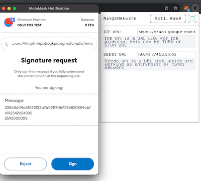

<picture>
  <source media="(prefers-color-scheme: dark)" srcset="https://static.ringsnetwork.io/ringsnetwork_logo.png">
  
</picture>

Rings Extension (This extension is under development)
===============

[](https://github.com/RingsNetwork/rings_ext_v2/actions/workflows/dev.yml)


# TL;DR

This is a implementation of Rings Extension, which support login rings network with metamask and other wallets.


# Screenshots




## Requirement

- **Nodejs** >= v16.13.0
- **pnpm** >= v8

## Usage

### Folders

- `src` - main source.
  - `contentScript` - scripts and components to be injected as `content_script`
  - `background` - scripts for background.
  - `components` - auto-imported React components that shared in popup and options page.
  - `styles` - styles shared in popup and options page
  - `manifest.ts` - manifest for the extension.
- `extension` - extension package root.
  - `assets` - static assets.
  - `dist` - built files, also serve stub entry for Vite on development.
- `scripts` - development and bundling helper scripts.

### Development

```bash
pnpm dev
```

Then **load extension in browser with the `extension/` folder**.

For Firefox developers, you can run the following command instead:

```bash
pnpm start:firefox
```

`web-ext` auto reload the extension when `extension/` files changed.

> While Vite handles HMR automatically in the most of the case, [Extensions Reloader](https://chrome.google.com/webstore/detail/fimgfedafeadlieiabdeeaodndnlbhid) is still recommanded for cleaner hard reloading.


#### Developing with Rings Node

In released version, dependencity of `rings-node` is included via released `tgz` file, such as:

```json
"@ringsnetwork/rings-node": "https://github.com/RingsNetwork/rings-node/releases/download/v0.3.5/rings-v0.3.5-wasm32-unknown-unknown.tgz",
```

if you wanna modifiy node's implementation at same time, you can modifiy rings-node dependencies in `package.json` to local git path, like:

```json
"@ringsnetwork/rings-node": "git+file:../rings-node#master",
```

Note: this local git syntax is only supported by yarn.

### Build

To build the extension, run

```bash
pnpm build
```

And then pack files under `extension`, you can upload `extension.crx` or `extension.xpi` to appropriate extension store.

### Load || Install

To load the extension from source:

* Chrome:

https://developer.chrome.com/docs/extensions/mv3/getstarted/development-basics/#load-unpacked

* Firefox

In Firefox: Open the about:debugging page, click the This Firefox option, click the Load Temporary Add-on button, then select any file in your extension's directory.

ref: https://developer.mozilla.org/en-US/docs/Mozilla/Add-ons/WebExtensions/Your_first_WebExtension
